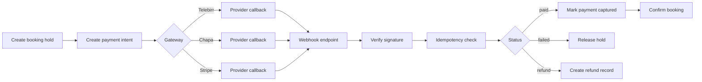

# Payment Flow and State Machine

## Order State Machine

- `initiated`
- `pending_payment`
- `confirmed`
- `cancelled`
- `expired`
- `refunded`

## Fraud Countermeasures

- Provider signature verification for each webhook.
- Idempotency event persistence (`provider + provider_event_id` unique).
- API rate limiting per IP/user for checkout endpoints.
- Risk rules for high-value transactions and frequent failures.
